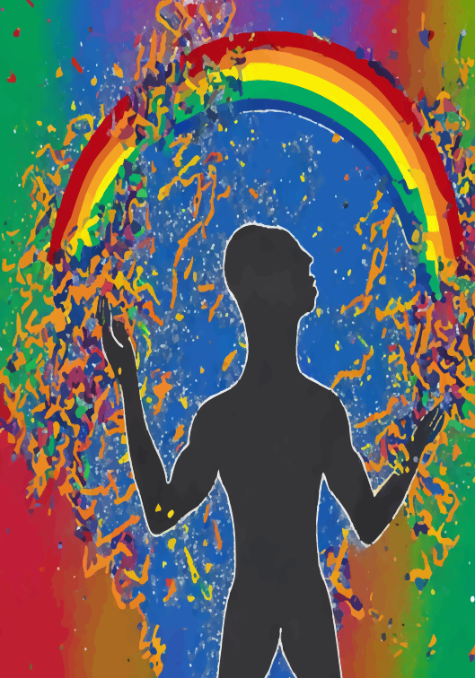

# Mutsuz diyarların insanları

Mutsuz diyarların insanları ne yaşadıklarını bilirler ne yaşattıklarını. Onlar sadece mutsuzdurlar ve bunu söylemekten çekinmezler. İşe geç kalır işten geç çıkarlar. Ceza puanları kabardığından maaşlarından kesinti yapılır. Veya vakitsiz çalışmanın getirdiği huzursuzluk onları depresyona sokar. Yaşlanırlar erkenden. Evlenmek zorunda kalır üstüne bir de çocukları olur. Mutsuz anne babanın mutlu çocukları olamaz ki ! Mutsuzluk sanki genetik bir kalıtımla geçer soydan soya. Hem üzüntülüdürler hem de üzüldüğünün keyfindeliğindedirler.

Düşünmezler labirenti çıkış yolu yok gibi ileri geri volta atarlar yol boyunca.Ve saatler boyu istemeden ve heyecansızca ve soluk almadan bu mesaileri devam eder durur. Vakti geldiğinde ölümün onları alacağını bilmeden, gözleri kapalı uykudadırlar.Uyandırmak lazım işte bu yüzden onları, hey ne duruyorsun be demeli, hareket et devir hız devri.Güneş görsün yüzün açılsın aydınlığa doğru kanatların.Ve sen de uyandır tüm tanıdıklarını.Çünkü sen de artık uyandın!...

Bu yazıları hız devrinde içinde bulunduğumuz bilgi çağı denen ucube cehalet devrinde yaşayanları tasvir etmek için yazdım.Madem ki bilmek erdem ve biz de o bilginin devrindeyiz.O halde silkelenmeliyiz ve üstümüze düşen görev neyse onu yapmalıyız.İyi bir anne baba olabilmek sadece biyolojik kalıtımı sürdürmek için değil toplumsal ödevimizi yerine getirmek için de şart.

Özgürlük ve haklar sorumluluklarını bilen insanlara verilir ya da insanlar bu özgürlükleri ve hakları alırlar bileklerinin hakkıyla.Diğer türlü hayat bir ileri bir geri volta atanlarla dolu.Ve yaşlandıkça yaşlanan ümitsizlerle dolu.Umarım size sizi hatırlatmışımdır.Yoksa amacım emir vermek değil sadece yol gösterdim denebilir.

Yol ki içinde pek çok yol barındırır.Yani size sizden bir parça gösterebilmekti tüm istediğim.Ne gibi hatalar olursa olsun yola devam engelleri aşarak devam fikri aklınızda olsun.Yoksa korku ve ümit arasında gitgeller ile yaşlanmak değil mesele, mesele bunları başkalarına da anlatabilecek birinin olmayışıdır. Çünkü ben senin sayende benim. Bu yazımın çabası da bu yüzden.

Görüşmek üzere Selamlar
